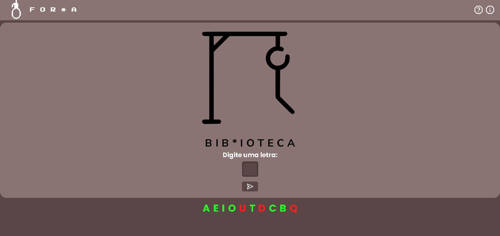

<h1 align="center">
  🎮 React Hangman Game (Jogo da Forca)
</h1>

<p align="center">
  Uma versão moderna, responsiva e acessível do clássico jogo da forca desenvolvida com <b>React 19</b>, <b>Vite</b> e <b>CSS3</b>.
</p>

<p align="center">
  <a href="https://react-hangman-game-amber.vercel.app/" target="_blank">
    
  </a>
</p>

<p align="center">
  
  
  
  
  
  
</p>

<!-- SEÇÃO DE PREVIEW / DEMONSTRAÇÃO DO PROJETO -->
<p align="center">
  
</p>

---

## 📌 Índice

- [Visão Geral](#-visão-geral)
- [Demonstração](#-demonstração)
- [Funcionalidades](#-funcionalidades)
- [Destaques Técnicos](#-destaques-técnicos)
- [Tecnologias Utilizadas](#-tecnologias-utilizadas)
- [Estrutura de Pastas](#-estrutura-de-pastas)
- [Como Executar o Projeto](#-como-executar-o-projeto)
- [Scripts Disponíveis](#-scripts-disponíveis)
- [Autor](#-autor)

---

## 📖 Visão Geral

> 🔗 **Acesse a aplicação rodando online:** [https://react-hangman-game-amber.vercel.app/](https://react-hangman-game-amber.vercel.app/)

O **React Hangman Game** traz a experiência do clássico jogo da forca para a web moderna. A aplicação sorteia palavras dinamicamente a partir de um banco de palavras leve, apresentando feedback visual instantâneo para acertos e erros, ilustrações progressivas da forca em SVG, além de modais de instrução, sobre o desenvolvedor e resultado final.

---

## ✨ Funcionalidades

- 🎲 **Sorteio Dinâmico de Palavras:** Carregamento assíncrono a partir de arquivo de texto local (`palavras.txt`).
- 🎨 **Estágios Visuais em SVG:** Ilustrações dinâmicas atualizadas a cada erro do jogador (do estágio 0 ao 6).
- ♿ **Modais Nativos e Acessíveis:** Janelas de *Ajuda*, *Sobre* e *Resultado* usando a API nativa `<dialog>` do HTML5.
- ⌛ **Tela de Carregamento (Loading):** Transição suave ao iniciar o jogo.
- 📱 **Design Responsivo:** Adaptável a dispositivos móveis, tablets e desktops.
- 🔄 **Reinício Rápido:** Opção de jogar novamente sem necessidade de atualizar a página.

---

## ⚡ Destaques Técnicos

1. **HTML5 `<dialog>` API:** Utilização da tag semântica nativa `<dialog>` com gerenciamento de estado via React refs (`showModal()` e `close()`), dispensando bibliotecas pesadas de modais externos.
2. **Manipulação de Estado Imutável:** Controle limpo de palavras adivinhadas, tentativas restantes e verificação de condições de vitória/derrota no React.
3. **Consumo Leve de Dados:** Leitura assíncrona com `fetch()` para extrair e filtrar dinamicamente a lista de palavras na inicialização.
4. **Vite 8:** Utilizado como ferramenta de build para proporcionar tempo de recarregamento rápido (HMR) e empacotamento otimizado.

---

## 🛠️ Tecnologias Utilizadas

| Tecnologia | Descrição |
| :--- | :--- |
| **[React 19](https://react.dev/)** | Biblioteca para construção da interface de usuário em componentes |
| **[Vite](https://vitejs.dev/)** | Build tool rápida para desenvolvimento Front-End moderno |
| **[React Router Dom](https://reactrouter.com/)** | Gerenciamento de rotas e navegação |
| **JavaScript (ES6+)** | Lógica de programação principal |
| **CSS3** | Estilização customizada e layout responsivo |
| **HTML5** | Estruturação semântica e acessibilidade nativa |

---

## 📁 Estrutura de Pastas

```text
React-Hangman-Game/
├── public/
│   ├── palavras.txt       # Base de dados local de palavras
│   └── pixel.svg
├── src/
│   ├── assets/            # Imagens SVG dos estágios da forca e perfis
│   ├── components/        # Componentes reutilizáveis do React
│   │   ├── AboutDialog    # Modal "Sobre o Autor"
│   │   ├── Game           # Lógica e interface principal do jogo
│   │   ├── HelpDialog     # Modal de instruções
│   │   ├── Loading        # Tela de carregamento inicial
│   │   ├── MenuWrapper    # Barra superior e navegação de menus
│   │   └── ResultDialog   # Modal de Vitória/Derrota
│   ├── App.jsx            # Componente raiz e carregamento de palavras
│   └── main.jsx           # Ponto de entrada da aplicação
├── package.json
└── vite.config.js
```

---

## 🚀 Como Executar o Projeto

### Pré-requisitos
Certifique-se de ter o **[Node.js](https://nodejs.org/)** (versão 18 ou superior recomendada) e o **npm** instalados na sua máquina.

### Passo a passo

1. **Clonar o repositório:**
   ```bash
   git clone https://github.com/MrHuguitos/React-Hangman-Game.git
   ```

2. **Acessar a pasta do projeto:**
   ```bash
   cd React-Hangman-Game
   ```

3. **Instalar as dependências:**
   ```bash
   npm install
   ```

4. **Executar a aplicação no modo de desenvolvimento:**
   ```bash
   npm run dev
   ```

5. **Abrir no navegador:**  
   Acesse a URL exibida no terminal (geralmente `http://localhost:5173`).

---

## ⚙️ Scripts Disponíveis

No repositório do projeto, você pode executar:

- `npm run dev`: Inicia o servidor local de desenvolvimento com Vite.
- `npm run build`: Cria a versão de produção otimizada na pasta `dist`.
- `npm run preview`: Executa visualização local do build de produção.
- `npm run lint`: Executa a verificação de código com ESLint.

---

## 👨‍💻 Autor

Desenvolvido por **Hugo Araujo** ([@MrHuguitos](https://github.com/MrHuguitos)).

Se você gostou deste projeto, sinta-se à vontade para deixar uma ⭐️ no repositório!
